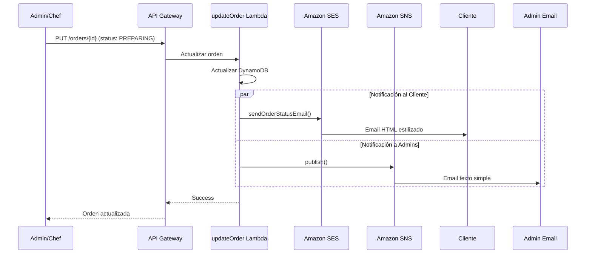

# 📧 Integración de Amazon SES para Emails Estilizados

## 📋 Resumen

Se ha integrado **Amazon SES (Simple Email Service)** para enviar emails HTML estilizados a los clientes cuando cambia el estado de su orden.

### Servicios de Notificación:

| Servicio | Destinatario | Formato | Uso |
|----------|-------------|---------|-----|
| **Amazon SES** | Cliente | HTML con CSS | Notificaciones de estado de orden |
| **Amazon SNS** | Administradores | Texto simple | Alertas administrativas |
| **WebSocket** | Cliente en tiempo real | JSON | Notificaciones instantáneas |

---

## 🎨 Plantillas de Email por Estado

### Estados soportados:

1. **CREATED** (✅ Verde) - Orden recibida
2. **PREPARING** (👨‍🍳 Naranja) - En preparación
3. **READY** (✨ Azul) - Lista para recoger
4. **ASSIGNED** (🚚 Morado) - Repartidor asignado
5. **IN_TRANSIT** (📍 Cyan) - En camino
6. **DELIVERED** (🎉 Verde) - Entregada
7. **CANCELLED** (❌ Rojo) - Cancelada

### Ejemplo de Email (ASSIGNED):

```html
<!DOCTYPE html>
<html>
<head>
  <title>🚚 Repartidor asignado</title>
</head>
<body>
  <!-- Header con gradiente morado -->
  <div style="background: linear-gradient(135deg, #9C27B0, #7B1FA2); padding: 40px;">
    <h1>🚚</h1>
    <h2>Repartidor en camino</h2>
  </div>
  
  <!-- Contenido -->
  <div style="padding: 30px;">
    <p>Hola <strong>Carlos</strong>,</p>
    <p>Un repartidor ha sido asignado a tu pedido.</p>
    
    <!-- Detalles de orden -->
    <div style="background: #f9f9f9; padding: 20px;">
      <h3>📋 Detalles de tu Orden</h3>
      <p><strong>Número de Orden:</strong> 716c4076-fbaf-431e-8c8e-a32db5df54ab</p>
      <p><strong>Estado:</strong> <span style="background: #9C27B0;">ASSIGNED</span></p>
    </div>
    
    <!-- Información del driver -->
    <div style="background: #f9f9f9; padding: 15px;">
      <h3>🚚 Información del Repartidor</h3>
      <p><strong>Nombre:</strong> Mauricio García</p>
    </div>
    
    <!-- Items -->
    <h3>🍽️ Tu Pedido</h3>
    <table>
      <tr>
        <td>Hamburguesa Clásica x2</td>
        <td>S/ 57.80</td>
      </tr>
      <tr>
        <td><strong>Total</strong></td>
        <td><strong>S/ 62.80</strong></td>
      </tr>
    </table>
    
    <!-- Dirección -->
    <h3>📍 Dirección de Entrega</h3>
    <p>Av. Principal 123<br>Miraflores, Lima</p>
  </div>
  
  <!-- Footer -->
  <div style="background: #f9f9f9; padding: 30px;">
    <p>📞 +51 987 654 321 | ✉️ soporte@fridays.pe</p>
    <p>© 2025 Fridays Perú</p>
  </div>
</body>
</html>
```

---

## 🚀 Configuración

### 1. Verificar Email en Amazon SES

```bash
# Dar permisos de ejecución
chmod +x scripts/verify-ses-email.sh

# Ejecutar script
./scripts/verify-ses-email.sh
```

**O manualmente**:
```bash
aws ses verify-email-identity \
  --email-address notificaciones@fridays.pe \
  --region us-east-1
```

**⚠️ Importante**: Revisa la bandeja de entrada de `notificaciones@fridays.pe` y haz clic en el link de verificación.

### 2. Verificar Estado de Verificación

```bash
aws ses get-identity-verification-attributes \
  --identities notificaciones@fridays.pe \
  --region us-east-1
```

Respuesta esperada:
```json
{
  "VerificationAttributes": {
    "notificaciones@fridays.pe": {
      "VerificationStatus": "Success"
    }
  }
}
```

### 3. Variables de Entorno

Ya configuradas en `serverless.yml`:

```yaml
environment:
  SNS_NOTIFICATIONS_TOPIC_ARN: arn:aws:sns:... # Para admins
  SES_FROM_EMAIL: notificaciones@fridays.pe    # Para clientes
  AWS_REGION: us-east-1
```

---

## 📝 Código Implementado

### `ses-client.js`

Utilidad para enviar emails con Amazon SES:

- ✅ Plantillas HTML por estado
- ✅ Diseño responsive
- ✅ Gradientes de color por estado
- ✅ Detalles completos de orden
- ✅ Información del repartidor
- ✅ Dirección de entrega
- ✅ Fallback a texto plano

### `updateOrder.js`

Actualizado para enviar notificaciones:

```javascript
// 1. Email al CLIENTE con SES (HTML estilizado)
await sendOrderStatusEmail(updatedOrder, driverInfo);

// 2. Notificación ADMIN con SNS (texto simple)
await sns.publish({
  TopicArn: SNS_TOPIC_ARN,
  Subject: `[ADMIN] Orden ${orderId} → ${status}`,
  Message: `Detalles administrativos...`
});
```

---

## 🧪 Testing

### Verificar email de prueba (para testing):

```bash
# Verificar tu propio email para recibir emails de prueba
aws ses verify-email-identity \
  --email-address tu-email@gmail.com \
  --region us-east-1
```

### Crear orden de prueba:

```bash
curl -X POST "https://rpepuemxp5.execute-api.us-east-1.amazonaws.com/dev/orders" \
  -H "Content-Type: application/json" \
  -H "Authorization: Bearer YOUR_TOKEN" \
  -d '{
    "items": [
      {"productId": "PRODUCT#101", "quantity": 1}
    ],
    "deliveryAddress": {
      "street": "Av. Test 123",
      "district": "Miraflores",
      "city": "Lima"
    }
  }'
```

### Actualizar estado (disparará email):

```bash
curl -X PUT "https://rpepuemxp5.execute-api.us-east-1.amazonaws.com/dev/orders/ORDER#xxx" \
  -H "Content-Type: application/json" \
  -H "Authorization: Bearer YOUR_ADMIN_TOKEN" \
  -d '{"status": "PREPARING"}'
```

---

## 📊 Flujo de Notificaciones



---

## ⚠️ Limitaciones de AWS Academy (SES Sandbox)

En AWS Academy, SES está en **modo Sandbox**, lo que significa:

1. ✅ Solo puedes enviar emails a direcciones **verificadas**
2. ✅ Límite de **200 emails/día**
3. ✅ Límite de **1 email/segundo**
4. ❌ No puedes enviar a emails no verificados

### Solución para Testing:

1. **Verifica emails de prueba**:
   ```bash
   aws ses verify-email-identity --email-address test@example.com
   ```

2. **Usa emails verificados en órdenes de prueba**:
   ```json
   {
     "customerInfo": {
       "email": "tu-email-verificado@gmail.com"
     }
   }
   ```

### Para Producción (fuera de AWS Academy):

1. Solicitar salida del Sandbox:
   - AWS Console → SES → Account Dashboard
   - "Request production access"
   
2. Configurar dominio propio:
   - Verificar dominio (fridays.pe)
   - Configurar DNS (SPF, DKIM, DMARC)

---

## 📈 Monitoreo

### Ver logs de emails enviados:

```bash
aws logs tail /aws/lambda/fridays-ecommerce-service-dev-updateOrder --since 10m | grep "SES"
```

### Ver métricas de SES:

```bash
aws ses get-send-statistics --region us-east-1
```

---

## 🎯 Próximos Pasos

1. ✅ **Desplegar ecommerce-service**
2. ✅ **Verificar email en SES**
3. ✅ **Probar cambio de estado**
4. ⏳ Agregar tracking de emails (open rate, click rate)
5. ⏳ Implementar plantillas para otros servicios
6. ⏳ Agregar adjuntos (PDF de factura)

---

## 🔗 Referencias

- [Amazon SES Documentation](https://docs.aws.amazon.com/ses/)
- [SES Email Templates](https://docs.aws.amazon.com/ses/latest/dg/send-personalized-email-api.html)
- [HTML Email Best Practices](https://www.campaignmonitor.com/dev-resources/guides/coding/)

---

**Implementado por**: Sistema AI Assistant  
**Fecha**: 1 de diciembre de 2025  
**Estado**: ✅ LISTO PARA DEPLOY
